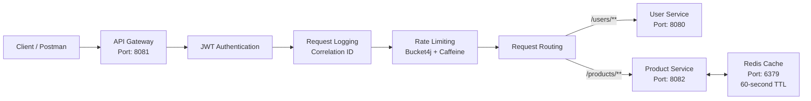

# Microservices API Gateway

A Spring Boot microservices project demonstrating how an API Gateway can provide a single entry point for multiple backend services while handling authentication, routing, request logging, rate limiting, and Redis-based caching.

## Architecture



## Project Structure

```text
microservices-api-gateway/
│
├── api-gateway/
│   ├── src/
│   ├── pom.xml
│   └── ...
│
├── user-service/
│   ├── src/
│   ├── pom.xml
│   └── ...
│
├── product-service/
│   ├── src/
│   ├── pom.xml
│   └── ...
│
├── README.md
└── .gitignore
```

## Services

### API Gateway

Runs on:

```text
http://localhost:8081
```

The API Gateway acts as the single entry point for clients.

Responsibilities:

* Request routing
* JWT authentication
* Request logging
* Correlation ID generation
* Rate limiting
* Forwarding requests to backend services

### User Service

Runs on:

```text
http://localhost:8080
```

Handles user-related CRUD operations.

Requests reaching the Gateway under:

```text
/users/**
```

are routed to the User Service.

### Product Service

Runs on:

```text
http://localhost:8082
```

Handles product-related CRUD operations.

Supported operations include:

```text
POST   /products
GET    /products
GET    /products/{id}
PUT    /products/{id}
DELETE /products/{id}
```

## Redis Caching

Redis is used as a caching layer for frequently requested product data.

Redis runs on:

```text
localhost:6379
```

The Product Service checks Redis before processing the product list request.

### Cache Miss

```text
GET /products
      ↓
Check Redis
      ↓
Cache MISS
      ↓
Get product data
      ↓
Store data in Redis
      ↓
Return response
```

### Cache Hit

```text
GET /products
      ↓
Check Redis
      ↓
Cache HIT
      ↓
Return cached response
```

The cache key is:

```text
products:all
```

The cached data has a **60-second TTL**.

## Rate Limiting

The API Gateway uses **Bucket4j with Caffeine** for rate limiting.

Current configuration:

```text
Capacity: 5 requests
Period: 1 minute
```

This prevents excessive requests from overwhelming the backend services.

> Note: The current rate limiter stores its state using Caffeine. Redis is used separately for product caching.

## JWT Authentication

The API Gateway validates JWT tokens before forwarding protected requests to backend services.

The general request flow is:

```text
Client
  ↓
API Gateway
  ↓
JWT Validation
  ↓
Valid Token?
  ├── Yes → Forward request
  └── No  → Reject request
```

The JWT secret should be externalized through configuration/environment variables rather than hard-coded in source code.

## Request Logging

The Gateway includes a custom logging filter.

For each request, it records:

* Correlation ID
* HTTP method
* Request path
* Response status
* Request processing time

Example:

```text
[correlation-id] Incoming request: GET /products
[correlation-id] Completed with status 200 in 35ms
```

The correlation ID can be used to trace a request through the Gateway.

## Technology Stack

* Java 26
* Spring Boot
* Spring Cloud Gateway
* Spring WebMVC
* JWT
* Bucket4j
* Caffeine
* Redis
* Docker
* WSL2
* Maven
* Postman

## Prerequisites

Install the following before running the project:

* Java 26
* Maven
* Docker Desktop
* Git
* Postman

Redis should be available through Docker.

## Running Redis

Start the Redis container:

```bash
docker run -d --name redis -p 6379:6379 redis:latest
```

Verify that Redis is running:

```bash
docker ps
```

Test the Redis connection:

```bash
docker exec -it redis redis-cli ping
```

Expected result:

```text
PONG
```

## Running the Services

Start the services individually during local development.

### 1. User Service

Start the User Service on:

```text
8080
```

### 2. Product Service

Start the Product Service on:

```text
8082
```

### 3. API Gateway

Start the API Gateway on:

```text
8081
```

Once all services are running, requests should be sent through the API Gateway.

## Example Requests

### Get Products

```http
GET http://localhost:8081/products
```

### Get Users

```http
GET http://localhost:8081/users
```

The Gateway routes these requests internally to the appropriate microservice.

## Testing Redis Cache

Clear the product cache:

```bash
docker exec -it redis redis-cli DEL products:all
```

Send:

```http
GET http://localhost:8081/products
```

The first request results in a cache miss and stores the product data in Redis.

A subsequent request can be served from the Redis cache.

Check the cached value:

```bash
docker exec -it redis redis-cli GET products:all
```

Check the remaining TTL:

```bash
docker exec -it redis redis-cli TTL products:all
```

## Project Benefits

This project demonstrates several common microservices patterns:

### Single Entry Point

Clients communicate with the API Gateway instead of directly accessing individual services.

### Centralized Authentication

JWT validation is handled at the Gateway rather than being duplicated across every service.

### Routing Abstraction

Backend service locations are hidden from clients.

### Rate Limiting

Excessive requests can be restricted before they reach backend services.

### Caching

Redis reduces repeated processing for frequently requested product data.

### Request Observability

Correlation IDs and request logging help with debugging and monitoring.

## Security

Sensitive configuration such as JWT secrets should not be committed to GitHub.

For local development, secrets can be supplied through configuration.

For production environments, secrets should be provided through:

* Environment variables
* Docker/Kubernetes secrets
* A dedicated secrets manager

Never commit real production credentials or secrets to the repository.

## Future Improvements

Possible future enhancements include:

* Distributed Redis-based rate limiting
* Centralized exception handling
* Service discovery
* Circuit breaker/fault tolerance
* Docker Compose for all services
* API documentation with OpenAPI/Swagger
* Production database integration
* Automated unit and integration tests
* CI/CD pipeline

## Author

**Kishan Debnath**

This project was built to demonstrate practical Java, Spring Boot, microservices, API Gateway, security, rate limiting, logging, caching, and containerization concepts.
